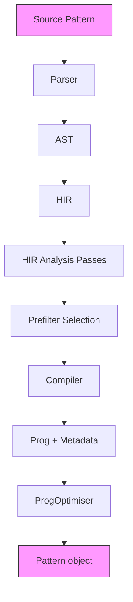
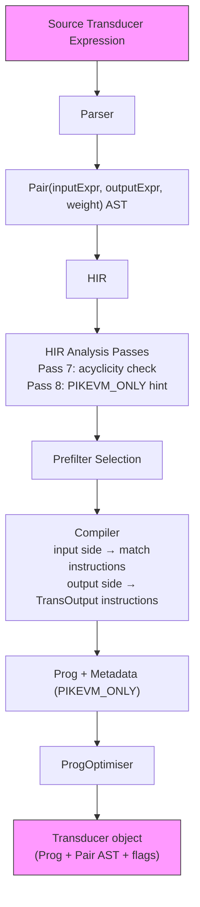
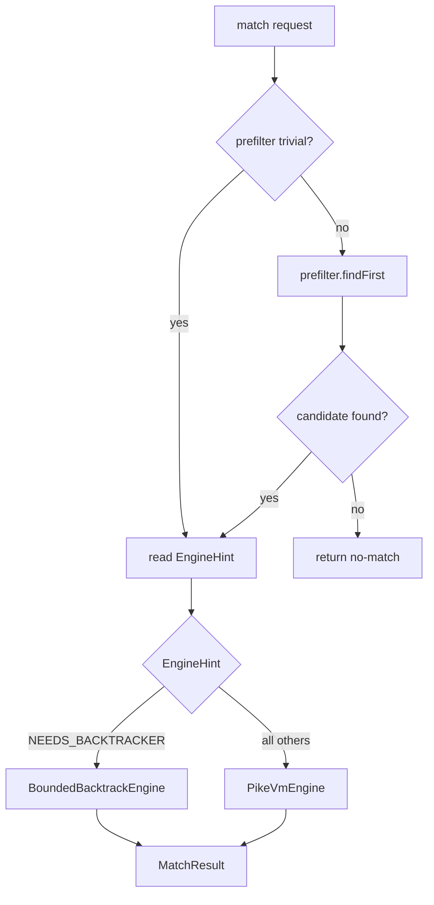
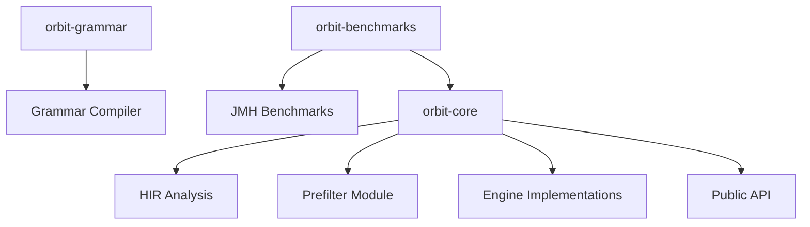

# Architecture Overview

**Audience:** Developer contributing to the library; architect evaluating it
**Purpose:** Explain the internal design so a new contributor can navigate the codebase.

## Compilation Pipeline

The compilation pipeline transforms a regular expression into a matcher. It runs five
analysis passes before compilation.



1. **Parser** — hand-written recursive-descent; produces `Expr` AST
2. **HIR** — builds High-Level Intermediate Representation from the AST
3. **HIR Analysis Passes** — five passes over the HIR tree:
   - Pass 1: HIR tree construction
   - Pass 2: literal prefix/suffix extraction → `LiteralSet`
   - Pass 3: one-pass safety check
   - Pass 4: output acyclicity and bounded-length analysis
   - Pass 5: engine classification → `EngineHint`; prefilter selection → `Prefilter`
4. **Compiler** — Thompson construction to `Prog` (immutable instruction array)
5. **ProgOptimiser** — post-compile pass; `foldEpsilonChains` rewrites every PC field to
   skip `EpsilonJump` chains; recurses into lookahead/lookbehind sub-programs; runs once
   inside `Pattern.buildCompileResult` before the final `Prog` is sealed
6. **Pattern object** — immutable, thread-safe; holds `Prog`, `Metadata`, `Prefilter`

`Metadata` carries: `hint`, `prefilter`, `groupCount`, `minLength`, `maxLength`,
`startAnchored`, `endAnchored`.

### Transducer Compilation Path

Transducer expressions follow the same pipeline with two modifications injected at steps 3
and 5. `Parser.parse` produces a `Pair(inputExpr, outputExpr, weight)` AST node instead of
a plain `Expr`; `AnalysisVisitor` Pass 7 validates output acyclicity and Pass 8 assigns
`EngineHint.PIKEVM_ONLY` to the pattern. In step 4, `Pattern.buildProg` emits
input-matching instructions for the left side of the `Pair` and then emits `TransOutput`
instructions for the right side; each `TransOutput` carries a delta string (a literal or a
backreference token such as `"$1"` or `"${name}"`). `ProgOptimiser.foldEpsilonChains` folds
epsilon chains across `TransOutput` instructions as it does for all other instruction types.
The resulting `Transducer` object holds the `Prog`, the original `Pair` AST (retained for
`invert()`), and the flags.



At match time, `PikeVmEngine` executes the `Prog` and appends each `TransOutput` delta to
an output buffer, resolving backreferences against the current capture state. On `Accept`,
the buffer becomes `MatchResult.output()`. See `docs/transducer-api-reference.md` for the
full method contracts.

## Meta-Engine Dispatch

`MetaEngine` runs in two phases: prefilter, then engine.



`DFA_SAFE` routes to `LazyDfaEngine`. `ONE_PASS_SAFE` routes to `OnePassDfaEngine`.
`NEEDS_BACKTRACKER` routes to `BoundedBacktrackEngine`. All other hints route to
`PikeVmEngine`.

## Module Dependency Diagram



- **orbit-core** — regex engine, parser, HIR, prefilter, API; no external dependencies
- **orbit-grammar** — optional grammar layer; builds on orbit-core
- **orbit-benchmarks** — JMH benchmark harness; depends on orbit-core

## Package Structure

```
com.orbit
├── api          # Public API: Pattern, Matcher, Transducer, Token, ErrorToken, MatchToken
├── engine       # Engine implementations: PikeVmEngine, BoundedBacktrackEngine,
│                #   LazyDfaEngine (stub routing), OnePassDfaEngine (stub routing)
├── hir          # HIR tree nodes and AnalysisVisitor (five passes)
├── prefilter    # Prefilter implementations: NoopPrefilter, VectorLiteralPrefilter,
│                #   AhoCorasickPrefilter, LiteralIndexOfPrefilter
├── prog         # Compiled program: Prog, Instr subtypes, Metadata, ProgOptimiser
├── util         # EngineHint, PatternFlag
└── parse        # Parser and AST (Expr hierarchy)
```

## Thread-Safety Model

| Type | Thread-safe? | Notes |
|---|---|---|
| `Pattern` | Yes | Immutable after construction |
| `Matcher` | No | One per thread; create from shared `Pattern` |
| `Transducer` | Yes | Immutable; `applyUp`, `applyDown`, `tokenize`, `invert`, `compose` all implemented |
| `LazyDfaEngine` | Yes | `DfaStateCache` uses `ConcurrentHashMap` |
| `PikeVmEngine` | No | `Matcher` layer provides isolation |
| `BoundedBacktrackEngine` | No | `Matcher` layer provides isolation |
| `Prog` | Yes | Immutable after construction |
| `Prefilter` | Yes | Immutable records |

## Extension Points

### Adding a new engine

1. Implement the `Engine` interface: `execute(Prog, String, int, int) → MatchResult`
2. Add a corresponding `EngineHint` value
3. Wire the routing in `MetaEngine.getEngine(EngineHint)`

### Adding new `Instr` types

1. Define a new `Instr` subclass
2. Update `Compiler` to emit it
3. Handle the new instruction in `PikeVmEngine` and `BoundedBacktrackEngine`

## Known Limitations

1. `Matcher` is not thread-safe — one per thread.
2. `Transducer` composed results from non-graph-eligible transducers (those with
   backreferences on the output side) are one-shot — `invert()` and further `compose()` on
   them throw `NonInvertibleTransducerException`. Composed results from graph-eligible
   (literal-output) transducers use `TransducerGraph` for structural composition and are
   fully invertible.
3. `MatchTimeoutException` is thrown by `BoundedBacktrackEngine` when the budget is
   exceeded — callers on `NEEDS_BACKTRACKER` patterns must catch it.
4. `LazyDfaEngine` and `OnePassDfaEngine` are wired into `MetaEngine.getEngine` for
   `DFA_SAFE` and `ONE_PASS_SAFE` patterns respectively.

---

## Glossary

| Type | Package | Description |
|---|---|---|
| `Pattern` | `com.orbit.api` | Compiles patterns; creates `Matcher` instances |
| `Matcher` | `com.orbit.api` | Executes matching; holds per-match state |
| `Transducer` | `com.orbit.api` | Immutable compiled transducer; `applyUp`, `applyDown`, `tokenize`, `invert`, `compose` |
| `EngineHint` | `com.orbit.util` | Classifies patterns for engine selection |
| `Prog` | `com.orbit.prog` | Immutable instruction array |
| `Metadata` | `com.orbit.prog` | Per-`Prog` analysis results: hint, prefilter, lengths, anchors |
| `Prefilter` | `com.orbit.prefilter` | Fast-path literal scan before engine dispatch |
| `Instr` | `com.orbit.prog` | Primitive operation in a compiled program |
