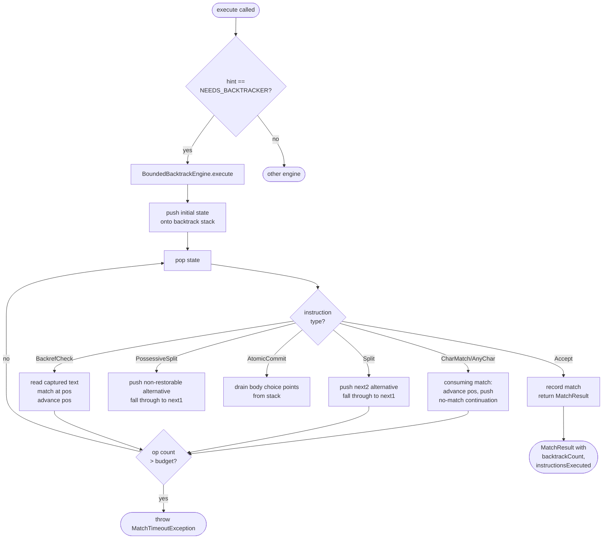

# Bounded Backtracking Engine

`BoundedBacktrackEngine` handles patterns classified `NEEDS_BACKTRACKER` — those containing
constructs that require backtracking state: `Backref` nodes (backreferences) and contextual
transducer `->` rules.

## Current status

`BoundedBacktrackEngine` is fully implemented as an iterative DFS engine with an explicit
heap stack. The `DEFAULT_BACKTRACK_BUDGET` (`1_000_000`) is enforced: when the budget is
exceeded the engine throws `MatchTimeoutException`. Possessive quantifiers and atomic groups
are handled via `PossessiveSplit` and `AtomicCommit` instructions.

`MatchResult.backtrackCount` and `instructionsExecuted` are populated after each call.

## Why these patterns need a separate engine

Two instruction types require backtracking that neither a DFA nor the Pike/Thompson
parallel simulation can handle correctly on their own:

**Backreferences (`BackrefCheck`).** A backreference such as `\1` matches the same text
that group 1 captured earlier. The text is not known at compile time, so no DFA transition
can be precomputed. Depth-first search allows re-trying paths after a backreference fails to
match, which the stateless parallel NFA simulation does not support.

**Contextual `->` rules.** Transducer rules that depend on surrounding context can require
the engine to backtrack to an earlier choice point after producing output, which the
stateless parallel NFA simulation does not support.

Patterns containing either construct receive `NEEDS_BACKTRACKER` from `AnalysisVisitor`.

## How bounded backtracking works

The engine explores the NFA depth-first using an explicit stack of choice points — not
recursive calls, so stack depth is bounded regardless of input length.

Each time the engine pushes a split alternative onto the stack it increments an operation
counter. When the counter reaches the budget, the engine throws `MatchTimeoutException`
rather than returning a wrong result or looping indefinitely.

Possessive quantifiers and atomic groups are handled specially:

- `PossessiveSplit` forks the NFA like a normal split but marks the current choice point
  as non-restorable — once the possessive branch succeeds, the alternative is discarded.
- `AtomicCommit` drains all choice points pushed by the body of an atomic group from the
  stack, implementing the commit-on-success semantics of `(?>...)`.

## Budget bound

The engine enforces an operation count limit (`DEFAULT_BACKTRACK_BUDGET = 1_000_000`).
Every consuming step and every split increments the counter. When the counter reaches the
budget, `MatchTimeoutException` is thrown rather than looping indefinitely.

The budget provides a hard wall against ReDoS but does not guarantee O(|NFA| × n)
termination — a future `VisitedSet` layer tracking `(pc, pos)` pairs would add that
guarantee. See `optimise/regex-session-prompts/session-3-bounded-backtracker.md` for the
planned design.

## Decision diagram

## Trade-offs vs unbounded backtracking

| Property | Unbounded backtracking (`java.util.regex`) | Bounded backtracking (Orbit) |
|---|---|---|
| Correct results | Yes | Yes, up to budget |
| ReDoS risk | Yes — O(2^n) possible | No — budget enforced |
| Result on budget exceeded | N/A | `MatchTimeoutException` |
| Backreference support | Yes | Yes |
| Possessive quantifiers | No | Yes |
| Atomic groups | No | Yes |
| Capture semantics | Perl/leftmost | Perl/leftmost |
| Time complexity | O(2^n) worst case | O(budget) hard limit; O(\|NFA\|×n) with VisitedSet (planned) |

## Thread safety

`BoundedBacktrackEngine` is not thread-safe. `MetaEngine` holds one shared `BACKTRACKER`
instance; the `Matcher` layer ensures only one match runs on that instance at a time.
