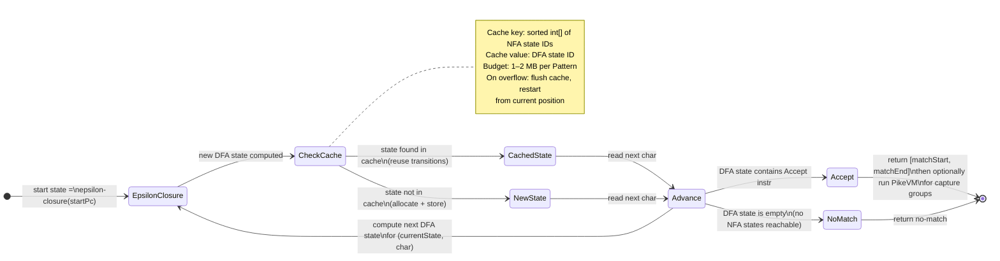

# Lazy DFA Engine

`LazyDfaEngine` targets patterns classified `DFA_SAFE`: no backreferences, no lookarounds,
no balancing groups, no transducer `Pair` nodes. For these patterns a DFA is correct and
runs in O(n) time, but building the full DFA up front (subset construction over all
possible input characters) can be exponential in the number of NFA states. The lazy
approach builds DFA states on demand, only for the character sequences that actually appear
in the input.

## Current status

`LazyDfaEngine` is fully implemented: lazy DFA state construction, a 1,024-state
`ConcurrentHashMap`-backed cache, alphabet equivalence class reduction via `AlphabetMap`,
and cache-flush fallback to `PikeVmEngine` on saturation are all present.

`MetaEngine` routes `DFA_SAFE` patterns to `LazyDfaEngine` (Phase 4 complete).

## How lazy DFA construction works

A DFA state in the lazy construction is the **epsilon-closure** of a set of NFA states.
The engine starts with the epsilon-closure of `prog.startPc` and processes one character
at a time:

1. For each NFA state in the current DFA state, find all consuming transitions
   (`CharMatch`, `AnyChar`) that match the current character.
2. Collect the union of their successor NFA states.
3. Compute the epsilon-closure of that union (following `EpsilonJump`, `Split`, and
   zero-width assertions).
4. That epsilon-closure is the next DFA state.

If the next DFA state has been seen before (it is in the cache), reuse the cached state
ID and its precomputed transitions. If it is new, allocate a state ID, store it in the
cache, and continue.

### Cache structure

`DfaStateCache` uses a `ConcurrentHashMap` keyed on a canonical representation of the
NFA state set (a sorted `int[]`), mapping to an integer DFA state ID. Each cached state
records whether it contains an `Accept` instruction.

The cache is bounded at 1,024 states (`DfaStateCache.MAX_STATES`). When a call to
`LazyDfaEngine.execute()` causes the state count to reach this limit, the cache is
flushed entirely and the current call falls back to `PikeVmEngine`. The next call
rebuilds the cache from scratch. The bound is not configurable at runtime.

Cache saturation is silent: no exception is raised and the `MatchResult` is identical to
what a DFA match would have returned.

### Captures and the hybrid approach

A pure DFA does not track which NFA path was taken, so it cannot fill capture group slots
directly. `LazyDfaEngine` finds only the match boundaries `[start, end]`. To extract
capture groups, the design calls for the **hybrid approach**:

1. `LazyDfaEngine` finds `[start, end]`.
2. `PikeVmEngine` runs on the substring `input[start..end]` to fill the groups.

Running `PikeVmEngine` on a bounded substring rather than the full input makes the second
pass cheap. Patterns with no capturing groups skip step 2 entirely.

## When it is preferred over PikeVM

For `DFA_SAFE` patterns without captures:

- `LazyDfaEngine` runs in O(n) time with one array lookup per character.
- `PikeVmEngine` runs in O(n × |NFA|) — the `|NFA|` factor can be significant for
  patterns with many alternatives or large character classes.

For `DFA_SAFE` patterns with captures, the hybrid approach is still cheaper than pure
PikeVM on long inputs because the DFA scan locates the match boundary quickly, and the
PikeVM sub-run is bounded to the matched region.

## State diagram

## Complexity

**Time:** O(n) amortised per match, after warm-up. Each character requires one cache
lookup and at most one new state construction. Cache flushes cause a local O(|NFA|)
reconstruction cost but do not change the overall bound for typical inputs.

**Space:** O(|NFA|²) for the cache in the worst case (exponential subset construction),
bounded in practice by the memory budget and flush policy.

## Thread safety

`LazyDfaEngine` is thread-safe. The singleton instance held by `MetaEngine` can be used
concurrently by multiple `Matcher` instances once it is wired in. `DfaStateCache` uses
`ConcurrentHashMap` and `AtomicInteger` for all mutations. Each matcher maintains its
own current DFA state pointer; the shared cache is read-only once a state is inserted.
