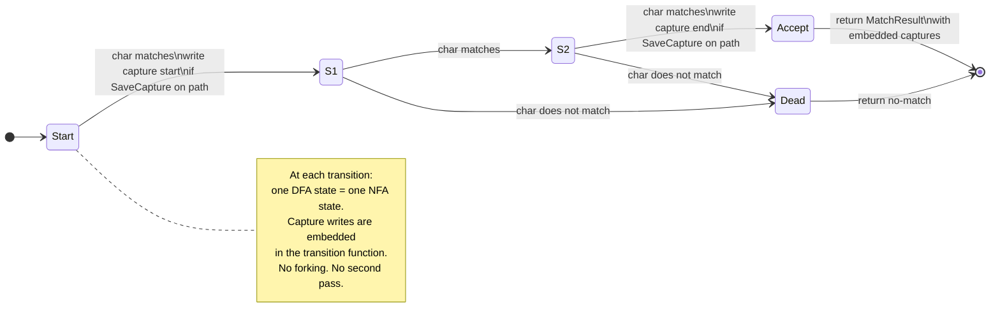

# One-Pass DFA Engine

`OnePassDfaEngine` is designed for the most restrictive pattern class: patterns that are
both DFA-safe and **one-pass safe**. The one-pass property allows capture groups to be
tracked inside the DFA itself, without a separate NFA simulation pass.

## Current status

Phase 4 complete. `OnePassDfaEngine` is a 185-line implementation backed by
`PrecomputedDfa` with BFS epsilon-closure and a flat-array table walk. It is wired into
`MetaEngine.getEngine` for `ONE_PASS_SAFE` patterns. When the NFA exceeds the DFA state
limit during precomputation, it falls back to `LazyDfaEngine`.

## What "one-pass" means

A pattern is one-pass safe when, at every point in the input, there is at most one NFA
state that can be active. Put differently: no two paths through the NFA can both be live
at the same input position. This means the NFA can be executed without forking threads and
without retaining multiple capture arrays — at each position there is exactly one state,
and that state records the single valid capture assignment.

`AnalysisVisitor.checkOnePassSafety` enforces a necessary condition: no quantifier node
wraps a `Pair` (transducer output) node. A quantifier over a transducer output can write
the same capture register multiple times on a single path, violating the one-per-path
write invariant required for one-pass DFA capture embedding.

Patterns that pass the one-pass check are annotated `ONE_PASS_SAFE` in `EngineHint`.

### Examples

```
Pattern          One-pass?   Reason
─────────────────────────────────────────────────────────────────
\d{4}-\d{2}      yes         linear structure, no ambiguity
(a|ab)c          no          at position 0, both 'a'-path and 'ab'-path are active
(\w+)\s+\1       no          BackrefCheck → NEEDS_BACKTRACKER, not one-pass
(a+)(b*)         yes         groups are non-overlapping and unambiguous
```

## How it differs from a full DFA

A standard DFA built from an NFA via subset construction tracks no capture information —
it only recognises whether a string is in the language. To extract capture groups with a
standard DFA you need a second pass: run the DFA to find the match boundaries, then run
the NFA on the matched substring to fill the groups (the hybrid approach used by
`LazyDfaEngine` + `PikeVmEngine`).

A one-pass DFA does not require that second pass. Because at most one NFA state is active
at each position, each DFA state maps directly to a single NFA state. The transition
function embeds `SaveCapture` semantics: when the DFA transitions through an instruction
that would have been a `SaveCapture` in the NFA, it writes the current position into the
corresponding capture slot. No fork, no ambiguity, no second pass.

## Safety guarantee

The one-pass property means the engine never forks and never backtracks. Time complexity
is O(n) — strictly one instruction executed per input character. Space complexity is O(G)
where G is the number of capture groups; the engine holds one capture slot pair per group
for the duration of the match, with no per-thread copying.

This makes `ONE_PASS_SAFE` patterns the cheapest case: DFA speed with full capture
extraction, no exponential blowup risk, no ReDoS surface.

## Relationship to EngineHint classification

`AnalysisVisitor` assigns hints in this priority order during `classifyEngine`:

1. If the node contains a `Backref` → `NEEDS_BACKTRACKER`
2. If the node is a `Pair` (transducer) → `PIKEVM_ONLY`
3. All other nodes → `DFA_SAFE`

`ONE_PASS_SAFE` is not assigned by `classifyEngine` directly. It is the intersection of
`DFA_SAFE` with a passing one-pass check (`HirNode.isOnePassSafe()`) and is surfaced
through `Pattern.isOnePassSafe()`. The routing in `MetaEngine` will promote `DFA_SAFE`
patterns that also pass the one-pass check to `OnePassDfaEngine` when that engine is
complete.

## State diagram



## Integration point

When fully implemented, `MetaEngine.getEngine` will route `ONE_PASS_SAFE` patterns here:

```java
case ONE_PASS_SAFE -> ONE_PASS_DFA;   // planned
```

The engine receives the same `Prog`, `input`, `from`, and `to` arguments as all other
`Engine` implementations and returns a `MatchResult` with `groups` fully populated.
