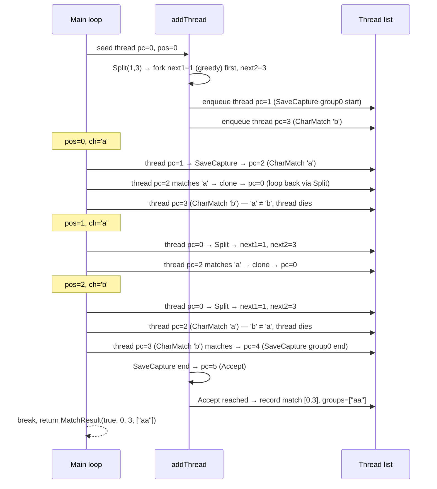

# PikeVM Engine

`PikeVmEngine` implements the Pike/Thompson NFA simulation algorithm. It is the universal
fallback: every instruction the Orbit compiler can emit is handled here, including
`BackrefCheck`, `SaveCapture`, anchors, and the full set of epsilon transitions. All
`EngineHint` values except `NEEDS_BACKTRACKER` route to this engine by default; even
`NEEDS_BACKTRACKER` routes here indirectly through `BoundedBacktrackEngine`.

## Algorithm

A classical backtracking engine recurses depth-first through NFA branches, which allows
exponential time on certain patterns. The Pike/Thompson approach eliminates that by running
all branches in parallel, one character at a time.

At each input position the engine maintains a prioritised list of active **threads**. A
thread is not an OS thread — it is a small `int[]` array holding a program counter and the
current capture register values for that branch of the NFA. Processing one character
advances every active thread by one step, producing the thread list for the next position.
Because at most one thread can occupy each NFA instruction at any position, the total
number of live threads is bounded by the number of instructions in the compiled program.

### Thread layout

```
thread[0]          : program counter (index into Prog.instructions)
thread[1]          : group 0 start position  (−1 if uncaptured)
thread[2]          : group 0 end position    (−1 if uncaptured)
thread[3]          : group 1 start position
thread[4]          : group 1 end position
...
thread[1 + 2*i]    : group i start
thread[2 + 2*i]    : group i end
```

Thread array size is `1 + groupCount * 2`. All capture slots are initialised to `-1`.

### Main loop

```
for startPos in [from, to]:          // try each possible match start
    seed one thread at startPos
    for pos in [startPos, to]:       // advance one character at a time
        for each thread in current:
            if thread.pc == Accept:
                record match, break outer
            if pos >= to:
                skip (no input to consume)
            if CharMatch or AnyChar matches ch:
                clone thread, set pc = next, enqueue in nextThreads
        swap current ← nextThreads
    check remaining threads for Accept
```

### Epsilon closure (addThread)

Epsilon transitions are followed eagerly without consuming input, inside `addThread`. A
`visited[]` boolean array (one entry per instruction, reset each position) prevents a
single thread from following the same epsilon arc twice at the same position, which keeps
the algorithm O(n × |NFA|) instead of potentially cyclic.

Instruction types handled as epsilon transitions:

| Instruction | Behaviour |
|---|---|
| `EpsilonJump` | Advance pc unconditionally |
| `Split(next1, next2)` | Fork: enqueue `next1` branch first (greedy/leftmost), then `next2` |
| `SaveCapture(group, isStart, next)` | Write current `pos` into the appropriate capture slot, advance pc |
| `BeginText` | Assert `pos == 0`; die otherwise |
| `BeginLine` | Assert `pos == 0` or `input[pos-1] == '\n'`; die otherwise |
| `EndText` | Assert `pos == to`; die otherwise |
| `EndLine` | Assert `pos == to` or `input[pos] == '\n'`; die otherwise |
| `BackrefCheck(group)` | Read captured substring for `group`; assert it matches at `pos`; advance `pos` by the captured length |

`BackrefCheck` is special: it reads previously recorded capture positions, compares the
corresponding input slice to the text at the current position, and if they match it
advances `pos` by the captured length before recursing into `addThread`. This is why
patterns with backreferences cannot be handled by a pure DFA.

Consuming instructions (`CharMatch`, `AnyChar`) and `Accept` terminate `addThread` and
cause the thread to be added to the output list as a runnable thread.

### Leftmost-longest semantics and priority

The thread list is ordered by priority. When `Split` forks, `next1` (the left/greedy
branch) is added before `next2`. The first thread to reach `Accept` at any position wins.
This implements leftmost-longest (POSIX-like greedy) semantics: among all matches starting
at the same position, the one produced by taking left-first alternatives and consuming as
much input as possible is selected.

Once `Accept` is reached for a given `startPos`, the outer loop breaks immediately — the
engine does not continue scanning for a longer match starting at a later position, because
the outer loop tries positions left-to-right and the first successful `startPos` is the
leftmost match.

## Capture tracking

Each thread carries its own copy of the capture array. When `addThread` processes a
`SaveCapture` instruction it clones the thread before writing the position, so other
threads sharing the same prior state are not affected.

The result array returned by `runNfa` has the format:

```
result[0]          : match start
result[1]          : match end
result[2]          : group 0 start
result[3]          : group 0 end
result[4]          : group 1 start
...
```

A group whose slots remain `-1` is reported as `null` in the `List<String>` returned by
`MatchResult.groups()`.

## Sequence diagram: matching `(a+)b` against `"aab"`



## Complexity

**Time:** O(n × |NFA|) where n = input length and |NFA| = number of instructions in
`Prog`. The `visited[]` array ensures each instruction is processed at most once per input
position. The outer `startPos` loop means worst-case is O(n² × |NFA|) for a find-anywhere
search over all start positions, but a prefilter typically reduces the candidate set.

**Space:** O(|NFA| × groupCount) per match call — one thread array of size
`1 + groupCount * 2` per live NFA state. The `visited[]` array is `O(|NFA|)` and is
allocated once per `runNfa` call.

Thread arrays are cloned on every fork and on every `SaveCapture`. For patterns with many
groups and high ambiguity this produces significant allocation pressure; a future
optimisation could use copy-on-write or a persistent-array structure.

## Why this is the fallback engine

`PikeVmEngine` handles every instruction type the Orbit compiler emits — including
`BackrefCheck`, which requires comparing substrings and cannot be expressed in a DFA.
No other currently-implemented engine covers `BackrefCheck`. The DFA-family engines
(`LazyDfaEngine`, `OnePassDfaEngine`) are restricted to DFA-safe patterns precisely because
they cannot handle backreferences or the full epsilon-transition set.

## Thread safety

`PikeVmEngine` instances are not thread-safe. The `visited[]` array and thread lists are
local to each `execute` call, but the instance itself should not be called concurrently.
`MetaEngine` holds a single shared `PIKE_VM` instance; the calling layer must ensure
only one match runs on that instance at a time, or create per-thread instances.
