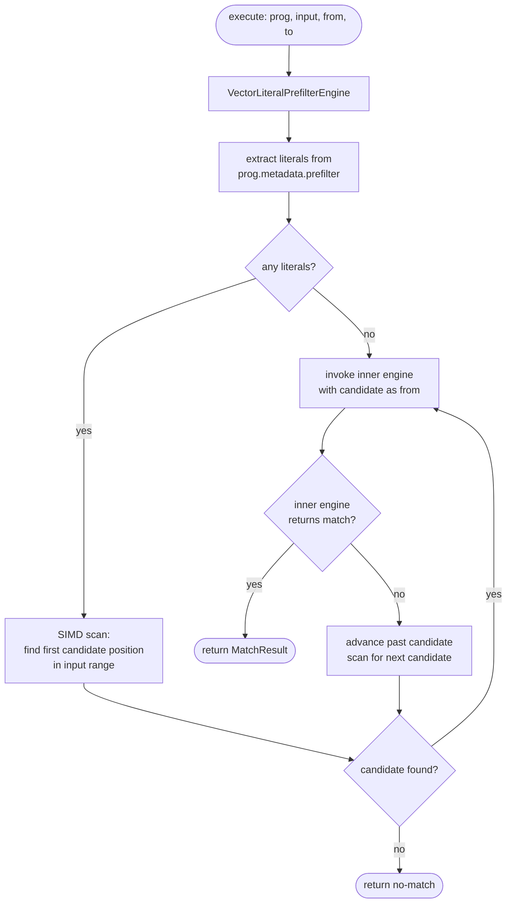

# Vector Literal Prefilter Engine

`VectorLiteralPrefilterEngine` is not a standalone matching engine — it wraps another
engine and accelerates it by scanning the input for candidate positions before invoking the
inner engine. The scan uses the JDK Vector API (Project Panama, available as incubator in
JDK 17 and standard in JDK 22+) to process multiple characters per CPU instruction.

## Current status

Two distinct things share similar names here:

**`VectorLiteralPrefilter`** (the prefilter object, in `com.orbit.prefilter`) — fully
implemented as an immutable record. Selected by `AnalysisVisitor` when a pattern has 1–10
extractable literal strings. `MetaEngine` calls `prefilter.findFirst(input, from, to)`
before invoking any engine. The implementation uses a `ShortVector` SIMD path (Phase 4
complete) with a scalar fallback for inputs shorter than 32 characters.

**`VectorLiteralPrefilterEngine`** (the engine wrapper class) — its `execute` method is a
stub that returns no-match. This class represents a planned composition where the SIMD scan
and the verification engine are explicit `Engine` implementations rather than the current
`MetaEngine` prefilter + engine pipeline. It is not used in production routing.

This document covers both the existing `VectorLiteralPrefilter` behaviour and the intended
`VectorLiteralPrefilterEngine` design.

## How the prefilter works today

`AnalysisVisitor` pass 2 extracts literal strings from the pattern's prefix `LiteralSet`.
Pass 5 selects a `Prefilter` implementation based on how many literals were found:

| Literal count | Prefilter | Algorithm |
|---|---|---|
| 0 | `NoopPrefilter` | Trivial — skipped at match time |
| 1–10 | `VectorLiteralPrefilter` | Scan using `String.indexOf` (scalar); Vector API SIMD planned for Phase 4 |
| 11–500 | `AhoCorasickPrefilter` (NFA mode) | Multi-pattern automaton |
| > 500 | `AhoCorasickPrefilter` (DFA mode) | Determinised Aho-Corasick |

`VectorLiteralPrefilter.findFirst` currently uses `String.indexOf` as a scalar fallback.
The production implementation will replace this with JDK Vector API calls that load
multiple characters into a vector register and test all of them against the first character
of each literal in a single instruction, then verify full-length matches only at positions
that pass the first-character test.

`MetaEngine.execute` calls `prefilter.findFirst(input, from, to)` before invoking any
engine. If `findFirst` returns `-1`, `MetaEngine` returns a no-match result immediately —
the engine is never called. If it returns a candidate position, `MetaEngine` passes that
position as the `from` argument to the engine, skipping the portion of the input that
cannot possibly contain a match.

## SIMD literal scan design

The Vector API approach for a single literal `L` of length `k`:

1. Load `W` characters from the input into a `CharVector` (W = vector lane count,
   typically 16 or 32 for 256-bit SIMD with 16-bit `char`).
2. Broadcast `L.charAt(0)` into a second vector of width W.
3. Compare the two vectors lane-by-lane; produce a mask of positions where the first
   character matches.
4. For each set bit in the mask, verify the remaining `k-1` characters with a scalar or
   vector comparison.
5. Return the first position that passes the full verification.

For multiple literals (up to 10), Orbit uses the same approach with a union of first-
character tests: broadcast each literal's first character and OR the resulting masks. This
finds any candidate position where at least one literal might start, then identifies which
literal matched during verification.

This is the **Teddy** algorithm pattern — named after the approach used by Hyperscan and
the Rust `regex-automata` crate. It is particularly effective for short, ASCII-only
literals on modern CPUs where a 256-bit SIMD comparison processes 16 characters at once.

## Engine composition diagram

## When VectorLiteralPrefilterEngine applies

The engine applies when:

1. The pattern has at least one extractable literal prefix (a sequence of literal
   characters at the start of every match).
2. The literal is short enough that SIMD scan overhead is recovered over the length of
   the input — in practice, inputs longer than a few hundred characters benefit.
3. The pattern is not trivially anchored to the start of input (`^`), which would make
   prefiltering pointless.

Patterns with `NEEDS_BACKTRACKER` or `PIKEVM_ONLY` hints can still use the prefilter —
`VectorLiteralPrefilterEngine` is hint-agnostic; it wraps whichever inner engine is
selected by `MetaEngine.getEngine` for the pattern.

## Why the prefilter is separate from the engine

The prefilter and the matching engine have independent correctness requirements:

- The **prefilter** may produce false positives (candidate positions where no match
  exists) but must never produce false negatives (it must not skip positions where a
  match does exist). A false positive costs one wasted engine call; a false negative
  produces a wrong result.
- The **engine** must be correct for all inputs; it is not affected by what the
  prefilter does.

Separating them means the prefilter can be replaced or upgraded independently. The current
`String.indexOf` scalar implementation and the planned Vector API implementation are
drop-in replacements — the engine sees only the candidate position returned by
`findFirst`.

## Performance characteristics

For a pattern like `"error: " + \w+` on a multi-megabyte log file where errors are rare:

- Without prefilter: engine processes every character position — O(n × |NFA|) total work.
- With SIMD prefilter: scan runs at ~16 characters per CPU cycle (256-bit SIMD); only
  positions near `"error: "` are passed to the engine.
- Speedup: significant on sparse-match workloads; exact numbers depend on literal length
  and input characteristics. This claim requires JMH benchmarking once the Vector API path
  is implemented.

The prefilter adds no overhead when the pattern has no extractable literals
(`NoopPrefilter.isTrivial()` returns `true` and `MetaEngine` skips it entirely).

## Thread safety

`VectorLiteralPrefilter` is a record (immutable). `VectorLiteralPrefilterEngine` holds no
mutable state. The inner engine wrapped by `VectorLiteralPrefilterEngine` must be
thread-safe or accessed with the same constraints as that engine.
